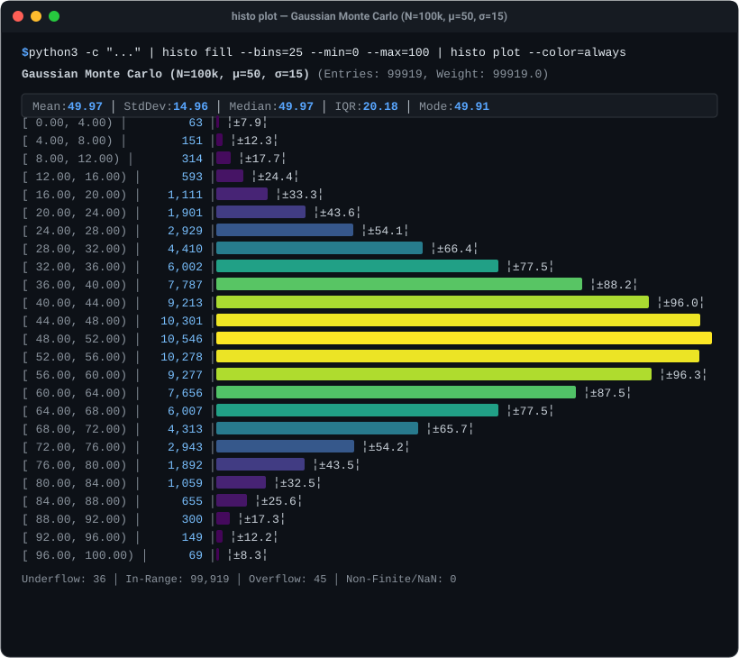

# libhisto User Manual & Architecture Guide {#mainpage}

Welcome to **libhisto**! This manual is organized as a progressive-disclosure guide across **Levels 0 through 6**. Whether you want a 30-second CLI pipeline, a 3-line Python/Perl script, a lightweight C99 integration, or full control over SIMD vector acceleration and DDSketch streaming math, you will find clear, copy-pasteable examples below.

---

## 1. Feature Map & Learning Path

```text
 ┌────────────────────────────────────────────────────────────────────────┐
 │ Level 0: 30-Second Quickstart (CLI, Python, Perl, C99)                 │
 ├────────────────────────────────────────────────────────────────────────┤
 │ Level 1: Summary Statistics, Auto-Binning & Plotting                   │
 ├────────────────────────────────────────────────────────────────────────┤
 │ Level 2: Kernel Density Estimation (KDE) & Smooth Curves               │
 ├────────────────────────────────────────────────────────────────────────┤
 │ Level 3: Parametric Curve Fitting & Regression (Gaussian, LM, Chi2/MLE)│
 ├────────────────────────────────────────────────────────────────────────┤
 │ Level 4: 2D Histograms, Heatmaps & Marginal Projections                │
 ├────────────────────────────────────────────────────────────────────────┤
 │ Level 5: Streaming Dynamic Quantile Sketches (DDSketch, Log-Bins)      │
 ├────────────────────────────────────────────────────────────────────────┤
 │ Level 6: High Performance, SIMD Vectorization & System Architecture    │
 └────────────────────────────────────────────────────────────────────────┘
```

---

## Level 0: 30-Second Quickstart

`libhisto` is a high-performance, zero-dependency ISO C99 library and Unix CLI toolkit for 1D and 2D distribution tracking, bivariate spatial analysis, statistical estimation, kernel density estimation, parametric curve fitting, and real-time terminal visualization.

### 0.1 Terminal Power Showcase (Copy-Pasteable One-Liners)



#### Live 60 FPS Distribution Telemetry (`histo top`)
Stream live samples into an interactive terminal dashboard with real-time Gaussian curve fitting (`f`), KDE overlays (`k`), and statistical error whiskers (`e`):

```bash
python3 -u -c "import random, time; [print(f'{random.gauss(50, 12):.2f}', flush=True) or time.sleep(0.001) for _ in range(100000)]" | \
  histo top --bins=60
```
> See the dedicated **[Real-Time Interactive Monitor Guide (`histo top`)](top_manual.md)** for full documentation of keybindings, overlays, and 2D mode.

#### Real-Time 2D Bivariate Heatmap (`histo top --2d`)
Stream bivariate coordinates into a live 24-bit TrueColor Viridis heatmap with Log-Z intensity contrast (`l`) and color range legend (`g`):

```bash
python3 -u -c "import random, time; [print(f'{random.gauss(50, 15):.2f} {random.gauss(50, 10) + 0.3 * (random.gauss(50, 15) - 50):.2f}', flush=True) or time.sleep(0.001) for _ in range(50000)]" | \
  histo top --2d --bins=35
```

#### Non-Linear Curve Fitting with Terminal Overlay (`histo fit -p`)
Compute Levenberg-Marquardt parametric fits directly from piped data with ASCII curve overlays:

```bash
python3 -c "import random; print('\n'.join(str(random.gauss(125.0, 3.5)) for _ in range(25000)))" | \
  histo fill --bins=40 --min=110 --max=140 | histo fit -m gaussian -p
```

#### Single-Line Shell Sparklines (`histo plot -S`)
```bash
python3 -c "import random; print('\n'.join(str(random.gauss(100, 15)) for _ in range(5000)))" | \
  histo fill -a --auto-range | histo plot -S
# Output:   ▂▃▅▇██▇▅▃▂   [N=5000, range=[45.2, 156.1), μ=100.1, σ=14.9]
```

### 0.2 Static CLI Plot Pipeline

Pipe any numeric stream directly into `histo plot` (or `histo fill` + `histo plot`):

```bash
# Generate 1,000 Gaussian numbers and render an instant terminal histogram
python3 -c "import random; print('\n'.join(str(random.gauss(50, 10)) for _ in range(1000)))" \
  | histo plot
```

**Terminal Output:**
```text
── Histogram (20 bins, range: [18.2, 81.6), entries: 1000, weight: 1000.0) ──
 [18.20, 21.37)     2 │ ▎
 [21.37, 24.54)     4 │ ▌
 [24.54, 27.71)     9 │ █▏
 [27.71, 30.88)    21 │ ██▋
 [30.88, 34.05)    45 │ █████▋
 [34.05, 37.22)    78 │ █████████▋
 [37.22, 40.39)   118 │ ██████████████▋
 [40.39, 43.56)   156 │ ███████████████████▍
 [43.56, 46.73)   188 │ ███████████████████████▎
 [46.73, 49.90)   160 │ ████████████████████
 [49.90, 53.07)   105 │ █████████████▏
 [53.07, 56.24)    59 │ ███████▍
 [56.24, 59.41)    32 │ ████
 [59.41, 62.58)    15 │ █▉
 [62.58, 65.75)     6 │ ▋
 [65.75, 68.92)     2 │ ▎
 ─────────────────────┴──────────────────────────────────────────────────────
```

### 0.2 Python 3 API

```python
import histo
import random

# Ingest data with automatic Freedman-Diaconis bin sizing and plot
data = [random.gauss(50, 10) for _ in range(1000)]
h = histo.Histogram.auto(data)
print(f"Mean: {h.mean():.2f} ± {h.std_dev():.2f} | Median: {h.median():.2f}")
h.plot()
```

### 0.3 Perl API

```perl
use Math::Histo;

my @data = map { 50 + 10 * rand() } 1..1000;
my $h = Math::Histo->create_auto(\@data);
printf "Mean: %.2f | StdDev: %.2f | Median: %.2f\n", $h->mean, $h->std_dev, $h->median;
$h->plot();
```

### 0.4 Minimal C99 Program

```c
#include <stdio.h>
#include <histo/histo.h>

int main(void) {
    // 1. Create a uniform histogram: 10 bins over [0.0, 100.0]
    histo_t *h = histo_create_uniform(10, 0.0, 100.0, HISTO_FLAG_TRACK_SUMW2);
    if (!h) return 1;

    // 2. Ingest samples
    histo_fill(h, 25.4);
    histo_fill_w(h, 50.0, 2.5); // Weighted sample

    // 3. Inspect summary
    printf("Total entries: %lu | Total weight: %.2f\n",
           (unsigned long)histo_num_entries(h), histo_total_weight(h));

    // 4. Clean teardown
    histo_destroy(h);
    return 0;
}
```

---

## Level 1: Summary Statistics, Auto-Binning & Plotting

`libhisto` tracks exact online Welford statistics (`HISTO_FLAG_EXACT_MOMENTS`) and per-bin uncertainty (`HISTO_FLAG_TRACK_SUMW2`) without bin discretisation error.

### 1.1 CLI Inspection (`histo stats` & Sparklines)

```bash
# Ingest CSV/TSV data and output comprehensive statistical summary
python3 -c "import random; print('\n'.join(f'{random.gauss(100, 10):.2f}\t{random.uniform(0.5, 2.0):.2f}' for _ in range(1000)))" | \
    histo fill -w --auto-range | histo stats

# Compact single-line sparkline for logs, scripts, and monitoring dashboards
python3 -c "import random, sys; sys.stdout.write(''.join(f'{random.gauss(50, 15):.4f}\n' for _ in range(10000)))" | \
    histo fill --bins=20 --auto-range | histo plot -S
```

**Sparkline Output:**
```text
    ▂▃▄▆▇██▇▆▄▂▂      [N=10000, range=[12.4, 88.6), μ=50.01, σ=9.98]
```

### 1.2 C99 Statistics Recipe

```c
#include <stdio.h>
#include <histo/histo.h>

int main(void) {
    histo_t *h = histo_create_uniform(100, 0.0, 100.0,
                                      HISTO_FLAG_TRACK_SUMW2 | HISTO_FLAG_EXACT_MOMENTS);

    for (int i = 1; i <= 100; ++i) {
        histo_fill(h, (double)i);
    }

    double mean = 0.0, std_dev = 0.0, median = 0.0, iqr = 0.0;
    histo_mean(h, &mean);
    histo_std_dev(h, &std_dev);
    histo_median(h, &median);
    histo_iqr(h, &iqr);

    printf("Mean: %.2f | StdDev: %.2f | Median: %.2f | IQR: %.2f\n",
           mean, std_dev, median, iqr);

    histo_destroy(h);
    return 0;
}
```

---

## Level 2: Kernel Density Estimation (KDE) & Smooth Curves

Non-parametric continuous density estimation with standard kernels (Gaussian, Epanechnikov, Boxcar, Triangular, Biweight, Cosine) and automated bandwidth selection (Silverman's rule of thumb, Scott's rule).

### 2.1 C99 KDE Recipe

```c
#include <stdio.h>
#include <histo/kde.h>

int main(void) {
    double samples[] = { 1.2, 2.3, 2.5, 3.1, 4.8, 5.0, 5.2, 6.1 };
    size_t n = sizeof(samples) / sizeof(samples[0]);

    // Construct model with default Gaussian kernel & Silverman bandwidth
    histo_kde_t *kde = histo_kde_create(n, samples, NULL, NULL);

    double pdf = histo_kde_eval(kde, 3.0);
    double cdf = histo_kde_cdf(kde, 3.0);
    double p50 = 0.0;
    histo_kde_quantile(kde, 0.50, &p50);

    printf("KDE Bandwidth: %.3f | PDF(3.0): %.4f | CDF(3.0): %.4f | Median: %.3f\n",
           histo_kde_get_bandwidth(kde), pdf, cdf, p50);

    histo_kde_destroy(kde);
    return 0;
}
```

### 2.2 Python & Perl KDE

```python
from histo import KDE

kde = KDE(samples, kernel="gaussian", bw_method="silverman")
print(f"Density at 3.0: {kde.eval(3.0):.4f} | Median: {kde.quantile(0.50):.3f}")
synthetic_data = kde.sample(100, seed=42)
```

```perl
use Math::Histo::KDE;

my $kde = Math::Histo::KDE->new(samples => \@samples, kernel => 'gaussian', bw_method => 'silverman');
my $pdf = $kde->eval(3.0);
my $median = $kde->quantile(0.50);
```

---

## Level 3: Parametric Curve Fitting & Regression

`libhisto` includes a non-linear least squares engine in `histo/fit.h` powered by the Levenberg-Marquardt optimizer with parameter box constraints and Poisson Maximum Likelihood Estimation (MLE).

### 3.1 CLI Curve Fitting (`histo fit`)

```bash
python3 -c "import random; print('\n'.join(str(random.gauss(50.0, 5.0)) for _ in range(10000)))" \
  | histo fill -n 50 --min 20 --max 80 \
  | histo fit -p
```

### 3.2 C99 Curve Fitting Recipe

```c
#include <stdio.h>
#include <histo/histo.h>
#include <histo/fit.h>

int main(void) {
    histo_t *h = histo_create_uniform(50, 20.0, 80.0, HISTO_FLAG_TRACK_SUMW2);
    // (Fill h with data...)

    histo_fit_options_t opts;
    histo_fit_options_init(&opts);
    opts.loss_type = HISTO_FIT_LOSS_CHI2;

    histo_fit_result_t *res = NULL;
    histo_status_t st = histo_fit_model(h, HISTO_FIT_MODEL_GAUSSIAN, NULL, &opts, &res);

    if (st == HISTO_OK && res->converged) {
        printf("Fit Converged in %u iterations!\n", res->iterations);
        printf("Amplitude: %.3f ± %.3f\n", res->params[0], res->param_errors[0]);
        printf("Mean (μ):  %.3f ± %.3f\n", res->params[1], res->param_errors[1]);
        printf("Sigma (σ): %.3f ± %.3f\n", res->params[2], res->param_errors[2]);
        printf("Reduced Chi2: %.3f (p-value: %.4f)\n", res->reduced_chi2, res->p_value);
    }

    histo_fit_result_destroy(res);
    histo_destroy(h);
    return 0;
}
```

---

## Level 4: 2-Dimensional Histograms & Spatial Heatmaps

Track bivariate distributions (X, Y) with online running covariance Cov(X, Y), Pearson correlation rho_xy, 9-region partitioned guard matrices, and marginal projections.

### 4.1 CLI 2D Pipeline

```bash
# Ingest bivariate coordinates and render 24-bit TrueColor terminal heatmap
python3 -c "import random; print('\n'.join(f'{random.gauss(-1.5, 1.0)},{random.gauss(-1.5, 1.0)}' if random.random() < 0.55 else f'{random.gauss(2.0, 0.8)},{random.gauss(2.0, 0.8)}' for _ in range(25000)))" \
  | histo fill --2d --xbins 30 --ybins 18 \
  | histo plot
```

### 4.2 C99 2D Histogram Recipe

```c
#include <stdio.h>
#include <histo/histo2d.h>

int main(void) {
    histo2d_t *h2d = histo2d_create_uniform(50, -5.0, 5.0, 50, -5.0, 5.0,
                                            HISTO_FLAG_TRACK_SUMW2 | HISTO_FLAG_EXACT_MOMENTS);

    histo2d_fill(h2d, 1.2, 2.4);
    histo2d_fill_w(h2d, -0.5, 0.5, 3.0);

    histo2d_stats_t stats;
    histo2d_get_stats(h2d, &stats);
    printf("2D Entries: %lu | Cov(X,Y): %.4f | Pearson Rho: %.4f\n",
           (unsigned long)stats.n_entries, stats.covariance, stats.correlation);

    // Extract 1D marginal projection along X
    histo_t *proj_x = NULL;
    histo2d_project_x(h2d, &proj_x);
    printf("Projected X total weight: %.2f\n", histo_total_weight(proj_x));

    histo_destroy(proj_x);
    histo2d_destroy(h2d);
    return 0;
}
```

---

## Level 5: Streaming Dynamic Quantile Sketches (DDSketch)

For streaming telemetry spanning unbounded numeric ranges, DDSketch (`include/histo/sketch.h`) guarantees a relative error bound alpha (e.g. +/- 1%) using dynamic logarithmic binning.

### 5.1 C99 DDSketch Recipe

```c
#include <stdio.h>
#include <histo/sketch.h>

int main(void) {
    // Relative error guarantee alpha = 0.01 (+/- 1%), max 1024 bins
    histo_sketch_t *sketch = histo_sketch_create(0.01, 1024);
    if (!sketch) return 1;

    histo_sketch_insert(sketch, 0.045);
    histo_sketch_insert(sketch, 1.250);
    histo_sketch_insert_w(sketch, 45.100, 3.0);

    double p50 = 0.0, p90 = 0.0, p99 = 0.0;
    histo_sketch_quantile(sketch, 0.50, &p50);
    histo_sketch_quantile(sketch, 0.90, &p90);
    histo_sketch_quantile(sketch, 0.99, &p99);

    printf("Quantiles -> P50: %.3f | P90: %.3f | P99: %.3f\n", p50, p90, p99);

    histo_sketch_destroy(sketch);
    return 0;
}
```

---

## Level 6: High Performance, Vectorization & Systems Engineering

### 6.1 SIMD Vector Acceleration

`histo_fill_n` and `histo2d_fill_n` evaluate batch coordinate arrays using vectorized hardware pipelines:
- **Runtime CPU Detection**: Dynamically selects AVX-512 (8-wide `double` vectors) or AVX2/FMA (4-wide `double` vectors) on x86_64, or NEON vector kernels on ARM64.
- **Branchless Masking**: Out-of-bounds (< min, >= max) and non-finite (`NaN` / `Inf`) samples are filtered with vector comparison masks.

```c
#define N_SAMPLES 1000000
double values[N_SAMPLES];
// Contiguous SIMD batch ingestion (~441 Mops/s on AVX-512 / AVX2)
histo_fill_n(h, N_SAMPLES, values, NULL);
```

### 6.2 Algorithmic Complexity Reference Table

| Function | Time Complexity | Auxiliary Space | Description |
| :--- | :--- | :--- | :--- |
| `histo_create_uniform` | O(N) | O(N) | Allocates and zeroes N equidistant bins |
| `histo_create_variable` | O(N) | O(N) | Validates monotonic edges and allocates N bins |
| `histo_destroy` | O(1) | O(1) | Deallocates histogram structure and bin arrays |
| `histo_find_bin` (Uniform) | O(1) | O(1) | Boundary-guarded fast reciprocal lookup |
| `histo_find_bin` (Variable) | O(log N) | O(1) | Monotonic bisection binary search |
| `histo_fill` / `_w` (Uniform) | O(1) | O(1) | Constant-time bin and accumulator increment |
| `histo_fill_n` (SIMD) | O(K / V) | O(1) | Vectorized batch ingest of K samples (V=4 or 8) |
| `histo_mean` / `histo_variance` | O(1) | O(1) | Direct query from online Welford accumulators |
| `histo_quantile` / `histo_median` | O(N) | O(1) | Single-pass cumulative inverse CDF scan |
| `histo_iqr` / `histo_trimmed_mean` | O(N) | O(1) | Cumulative percentile integration |
| `histo_mad` | O(N) | O(1) | Two-pointer monotonic merge for weighted median absolute deviation |
| `histo_kde_eval` | O(n) | O(1) | Continuous density sum across n points |
| `histo_kde_quantile` | O(n * iter) | O(1) | Hybrid bisection / Newton-Raphson CDF root solver |
| `histo_fit_model` (LM) | O(I * (N * P + P^3)) | O(N * P + P^2) | Levenberg-Marquardt non-linear regression |
| `histo2d_fill` (Uniform) | O(1) | O(1) | 2D coordinate lookup & Welford comoments |
| `histo2d_project_x/y` | O(Nx * Ny) | O(Nx) or O(Ny) | Integrates across orthogonal axis |
| `histo_sketch_insert` | O(1) | O(1) | DDSketch dynamic logarithmic mapping |

---

## 7. Building & Installation

### CMake Integration (`FetchContent`)
```cmake
include(FetchContent)
FetchContent_Declare(
    libhisto
    GIT_REPOSITORY https://github.com/steffenm/libhisto.git
    GIT_TAG        main
)
FetchContent_MakeAvailable(libhisto)
target_link_libraries(your_target PRIVATE libhisto::libhisto)
```

### Build from Source
```bash
cmake -B build -S . -DCMAKE_BUILD_TYPE=Release
cmake --build build
ctest --test-dir build --output-on-failure
sudo cmake --install build
```
